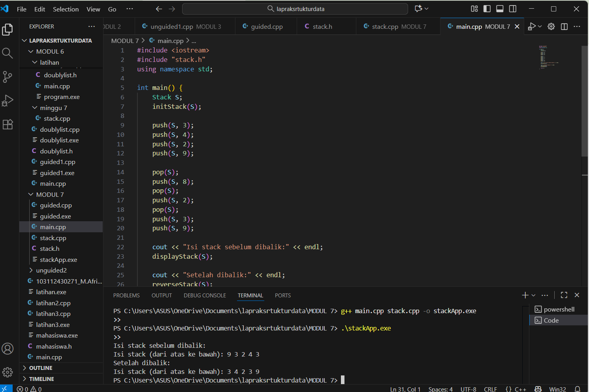
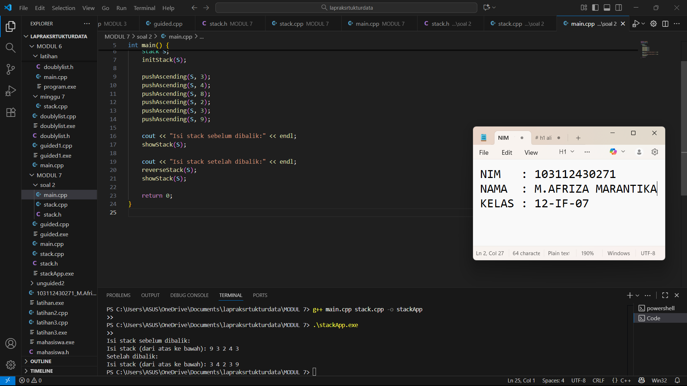
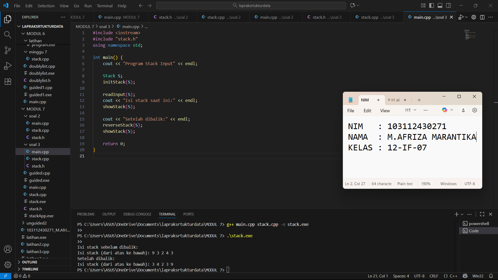

# M.AFRIZA-MARANTIKA-103112430271Modul7
# <h1 align="center">Laporan Praktikum Modul 7 <br> Stack</h1>
<p align="center">M.Afriza Marantika - 103112430271</p>

## Dasar Teori
Struktur data stack adalah struktur data linear yang bekerja dengan prinsip LIFO (Last In First Out), di mana elemen yang terakhir dimasukkan akan menjadi elemen pertama yang diambil. Stack dapat diimplementasikan menggunakan array atau pointer, dengan satu penunjuk utama bernama TOP yang menunjukkan posisi elemen teratas. Operasi dasar yang dilakukan pada stack meliputi push untuk menambah data ke atas stack, pop untuk menghapus data teratas, dan printInfo untuk menampilkan seluruh isi stack. Selain itu, terdapat operasi tambahan seperti balikStack untuk membalik urutan data, pushAscending untuk memasukkan elemen agar tetap terurut menaik, dan getInputStream untuk membaca input secara berurutan dari pengguna. Pada implementasi berbasis array, ukuran stack bersifat tetap sehingga kapasitasnya terbatas, namun akses data menjadi cepat karena penggunaan indeks tanpa perlu pengelolaan memori dinamis.
## Guide

```go
#include <iostream>
using namespace std;

struct Node
{
    int data;
    Node *next;
};

bool isEmpety(Node *top)
{
    return top == nullptr;
}

void push(Node *&top, int data){
    Node *newNode = new Node;
    newNode -> data = data;
    newNode -> next = top;
    top = newNode;
}

int pop(Node *&top)
{
    if (isEmpety(top))
    {
        cout << "Stack Kosong, tidak bisa pop!" << endl;
        return 0;
    }

    int poppedData = top -> data;
    top = top -> next;

    Node *temp;
    return poppedData;
}

void show (Node *top)
{
    if (isEmpety(top))
    {
        cout << "Stack kosong," << endl;
        return;
    }
    cout << "TOP -> ";
    Node *temp = top;

    while (temp != nullptr)
    {
        cout << temp->data << "-> ";
        temp = temp->next;
    }

    cout << "NULL" << endl;

}

int main()
{
    Node *stack = nullptr;

    push(stack, 10);
    push(stack, 20);
    push(stack, 30);

    cout << "Menampilkan isi stack:" << endl;
    show (stack);

    cout << "pop;" << pop(stack) << endl;

    cout << "Menampilkan sisa Stack:" << endl;
    show(stack);

    return 0;
}
```


## Unguide

### Soal 1

### stack.h
```go
#ifndef STACK_H
#define STACK_H

#define MAX 20

typedef int DataType;

struct Stack {
    DataType data[MAX];
    int top;
};

void initStack(Stack &S);
bool isEmpty(Stack S);
bool isFull(Stack S);
void push(Stack &S, DataType value);
DataType pop(Stack &S);
void displayStack(Stack S);
void reverseStack(Stack &S);

#endif

```

### stack.cpp
```go
#include <iostream>
#include "stack.h"
using namespace std;

void initStack(Stack &S) {
    S.top = -1;
}

bool isEmpty(Stack S) {
    return S.top == -1;
}

bool isFull(Stack S) {
    return S.top == MAX - 1;
}

void push(Stack &S, DataType value) {
    if (!isFull(S)) {
        S.top++;
        S.data[S.top] = value;
    } else {
        cout << "Stack penuh, tidak bisa menambah data!" << endl;
    }
}

DataType pop(Stack &S) {
    if (!isEmpty(S)) {
        DataType temp = S.data[S.top];
        S.top--;
        return temp;
    } else {
        cout << "Stack kosong, tidak ada data untuk dihapus!" << endl;
        return -1;
    }
}

void displayStack(Stack S) {
    cout << "Isi stack (dari atas ke bawah): ";
    for (int i = S.top; i >= 0; i--) {
        cout << S.data[i] << " ";
    }
    cout << endl;
}

void reverseStack(Stack &S) {
    Stack temp;
    initStack(temp);

    while (!isEmpty(S)) {
        push(temp, pop(S));
    }
    S = temp;
}

```

### main.cpp
```go
#include <iostream>
#include "stack.h"
using namespace std;

int main() {
    Stack S;
    initStack(S);

    push(S, 3);
    push(S, 4);
    push(S, 2);
    push(S, 9);

    pop(S);
    push(S, 8);
    pop(S);
    push(S, 2);
    pop(S);
    push(S, 3);
    push(S, 9);

    cout << "Isi stack sebelum dibalik:" << endl;
    displayStack(S);

    cout << "Setelah dibalik:" << endl;
    reverseStack(S);
    displayStack(S);

    return 0;
}

```

> Output
> 

Program ini membuat struktur data stack yang bekerja dengan prinsip LIFO (Last In First Out), artinya data yang terakhir dimasukkan akan keluar lebih dulu. Stack disimpan dalam array dengan penunjuk top untuk posisi teratas. Ada fungsi untuk menambah data (push), menghapus data (pop), menampilkan isi stack (printInfo), dan membalik urutan data (balikStack). Di fungsi main, program menambahkan dan menghapus beberapa nilai, lalu menampilkan isi stack sebelum dan sesudah dibalik.

### Soal 2

### stack.h
```go
#ifndef STACK_H
#define STACK_H

#define MAX 20
typedef int DataType;

struct Stack {
    DataType data[MAX];
    int top;
};

// Inisialisasi stack
void initStack(Stack &S);

// Operasi dasar
void push(Stack &S, DataType value);
DataType pop(Stack &S);
void showStack(Stack S);
void reverseStack(Stack &S);

// Operasi tambahan
void pushAscending(Stack &S, DataType value);

#endif

```

### stack.cpp
```go
#include <iostream>
#include "stack.h"
using namespace std;

void initStack(Stack &S) {
    S.top = -1;
}

void push(Stack &S, DataType value) {
    if (S.top == MAX - 1) {
        cout << "Stack penuh!" << endl;
    } else {
        S.top++;
        S.data[S.top] = value;
    }
}

DataType pop(Stack &S) {
    if (S.top == -1) {
        cout << "Stack kosong!" << endl;
        return -1;
    } else {
        DataType temp = S.data[S.top];
        S.top--;
        return temp;
    }
}

void showStack(Stack S) {
    cout << "[TOP] ";
    for (int i = S.top; i >= 0; i--) {
        cout << S.data[i] << " ";
    }
    cout << endl;
}

void reverseStack(Stack &S) {
    Stack temp;
    initStack(temp);

    while (S.top != -1) {
        push(temp, pop(S));
    }

    S = temp;
}

void pushAscending(Stack &S, DataType value) {
    Stack temp;
    initStack(temp);

    // Pindahkan elemen lebih besar ke stack sementara
    while (S.top != -1 && S.data[S.top] > value) {
        push(temp, pop(S));
    }

    // Masukkan elemen baru
    push(S, value);

    // Kembalikan elemen dari stack sementara
    while (temp.top != -1) {
        push(S, pop(temp));
    }
}

```

### main.cpp
```go
#include <iostream>
#include "stack.h"
using namespace std;

int main() {
    Stack S;
    initStack(S);

    pushAscending(S, 3);
    pushAscending(S, 4);
    pushAscending(S, 8);
    pushAscending(S, 2);
    pushAscending(S, 3);
    pushAscending(S, 9);

    cout << "Isi stack sebelum dibalik:" << endl;
    showStack(S);

    cout << "Isi stack setelah dibalik:" << endl;
    reverseStack(S);
    showStack(S);

    return 0;
}

```

> Output
> 

Program ini membuat dan mengelola struktur data Stack menggunakan array dengan konsep LIFO (Last In First Out), yaitu data yang terakhir dimasukkan akan keluar lebih dulu. File stack.h berisi deklarasi struktur Stack, yang memiliki array data untuk menyimpan elemen dan variabel top untuk menunjukkan posisi data teratas, serta deklarasi fungsi-fungsi operasi stack seperti initStack, push, pop, showStack, reverseStack, dan pushAscending. Pada stack.cpp, fungsi initStack digunakan untuk mengosongkan stack, push menambah data ke atas stack, pop menghapus data teratas, showStack menampilkan isi stack dari atas ke bawah, reverseStack membalik urutan isi stack menggunakan stack sementara, dan pushAscending menambahkan elemen baru ke stack agar tetap dalam urutan menaik. Di main.cpp, fungsi-fungsi tersebut digunakan untuk membuat stack, memasukkan data dengan urutan menaik, menampilkan isi stack, lalu membalik urutan data dan menampilkannya kembali.

### Soal 3

### stack.h
#ifndef STACK_H
#define STACK_H

#define MAX 20
typedef int DataType;

struct Stack {
    DataType data[MAX];
    int top;
};

// Deklarasi fungsi
void initStack(Stack &S);
void push(Stack &S, DataType value);
DataType pop(Stack &S);
void showStack(Stack S);
void reverseStack(Stack &S);
void readInput(Stack &S);

#endif

```

### stack.cpp
```go
#include <iostream>
#include "stack.h"
using namespace std;

void initStack(Stack &S) {
    S.top = -1;
}

void push(Stack &S, DataType value) {
    if (S.top == MAX - 1) {
        cout << "Stack penuh!" << endl;
    } else {
        S.top++;
        S.data[S.top] = value;
    }
}

DataType pop(Stack &S) {
    if (S.top == -1) {
        cout << "Stack kosong!" << endl;
        return -1;
    } else {
        DataType temp = S.data[S.top];
        S.top--;
        return temp;
    }
}

void showStack(Stack S) {
    cout << "[TOP] ";
    for (int i = S.top; i >= 0; i--) {
        cout << S.data[i] << " ";
    }
    cout << endl;
}

void reverseStack(Stack &S) {
    Stack temp;
    initStack(temp);

    while (S.top >= 0) {
        push(temp, pop(S));
    }

    S = temp;
}

void readInput(Stack &S) {
    cout << "Masukkan angka (akhiri dengan ENTER): ";

    char inputChar;
    cin.get(inputChar);

    while (inputChar != '\n') {
        if (isdigit(inputChar)) {  // cek apakah karakter angka
            push(S, inputChar - '0');
        }
        cin.get(inputChar);
    }
}


```

### main.cpp
```go
#include <iostream>
#include "stack.h"
using namespace std;

int main() {
    cout << "Program Stack Input" << endl;

    Stack S;
    initStack(S);

    readInput(S);
    cout << "Isi stack saat ini:" << endl;
    showStack(S);

    cout << "Setelah dibalik:" << endl;
    reverseStack(S);
    showStack(S);

    return 0;
}


```

> Output
> 

Program ini membuat struktur data stack dengan prinsip LIFO (Last In First Out). File stack.h berisi struktur dan deklarasi fungsi stack, sedangkan stack.cpp berisi logika seperti membuat stack, menambah data (push), menghapus data (pop), menampilkan isi (printInfo), membalik urutan (balikStack), dan membaca input dari pengguna (getInputStream). Di main.cpp, program membuat stack, meminta input angka, menampilkan isi stack, lalu membalik dan menampilkannya lagi.

## Referensi
1. https://www.w3schools.com/cpp/cpp_functions.asp
2. https://www.w3schools.com/cpp/cpp_arrays.asp
3. https://www.w3schools.com/cpp/cpp_user_input.asp
4. https://www.w3schools.com/cpp/cpp_while_loop.asp
5. https://www.w3schools.com/cpp/cpp_stacks.asp
